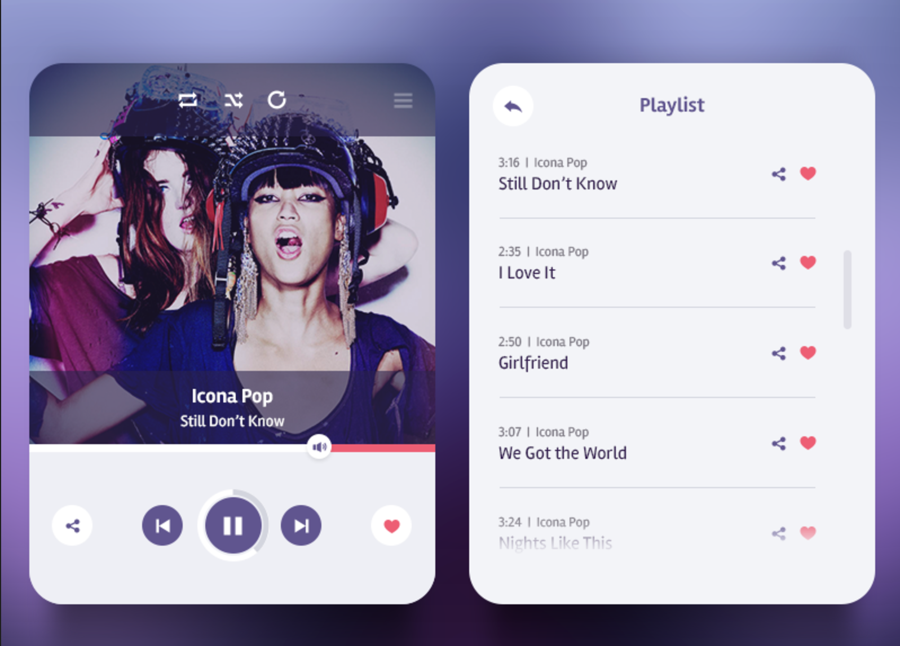

## Zadanie rekrutacyjne dla Frontend Developer'a

**Cześć!**

Super, że zainteresowałeś się naszą ofertą pracy! Mamy dla Ciebie małe zadanie, które jest pierwszym etapem rekrutacji do naszej firmy. 
Zakoduj proszę widget dostępny w załączniku (widok obrazka widget-screen-intreview.png) i udostępnij go na GitHub. Następnie prześlij nam email z linkiem do gotowego zadania. 

##Link do PSD -> <a href="player.zip">Widget PSD</a>

Widżet został stworzony przez <a href="https://dribbble.com/OliaGozha">Olia Gozha</a>. 

## Wymagania:
* Widget powinien być zaprogramowany w HTML5, CSS3 i JavaScript przy użyciu jQuery lub Vue.js(lepiej oceniane, bo w tym frameworku będziesz pracował/ła). Dopuszczamy inne gotowe biblioteki.
* Widget powinien działać pod najnowszymi przeglądarkami Chrome, Firefox.
* Widget powinien być klikalny, ale oczywiście Twoje zadanie nie polega na stworzeniu działającego playera ;)
* Po kliknięciu przycisk Play powinien zmieniać się w przycisk Pause i odwrotnie.
* Po kliknięciu przycisku "Hamburger" użytkownik powinien zobaczyć listę utworów.
* Po kliknięciu przycisku powrotu na liście utworów użytkownik powienien powrócić do widoku playera.
* Po kliknięciu na utwór na liście utworów użytkownik powinien zostać przeniesiony do widoku playera i zobaczyć piosenkę, którą wybrał z listy.
* Po kliknięciu przycisku next/prev w widoku playera użytkownik powinien zobaczyć kolejną/poprzednią piosenkę z listy.
* Wykorzystanie maksimum natywnych możliwości CSS w zastępstwie dla grafik wyciętych z PSD będzie bardzo mile widziane. Można stosować Font Awesome jako alternatywa dla obrazków.
* Zwróć szczególną uwagę na jakość, formatowanie i konwencje kodu, ale także na odwzorowanie wizualne i estetyczne widget screen'a.
* Zadanie nie ma wąskich ograniczeń czasowych, natomiast szybki czas realizacji będzie wielkim plusem i szczególnie brany pod uwage.
* W razie pytań pisz do nas śmiało.

Powodzenia!

### PS.
Twoja praca nie zostanie wykorzystana w żaden komercyjny sposób. Ma ona na celu jedynie sprawdzenie Twoich umiejętności w pierwszym etapie rekrutacji.
